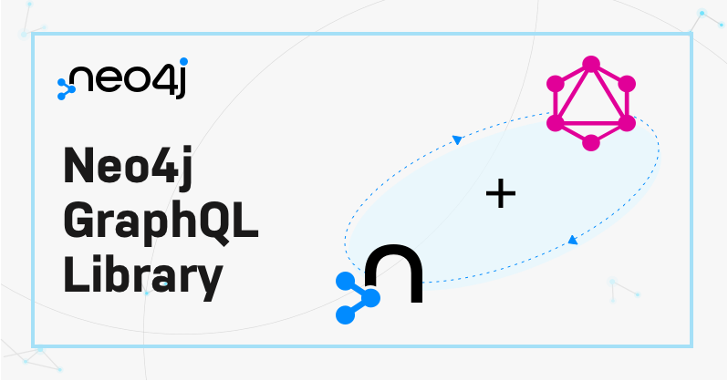

# Neo4j GraphQL Library

💡 Welcome to the Monorepo for [Neo4j](https://neo4j.com/) + [GraphQL](https://graphql.org/).

> We are working on Neo4j GraphQL 2.0.0, you can download the release candidate via `npm install @neo4j/graphql@next` and checkout the docs [here](https://neo4j.com/docs/graphql-manual/2.0/).

  
  

## Contributing

Want to contribute to `@neo4j/graphql`? See our [contributing guide](./docs/markdown/CONTRIBUTING.md) and [development guide](./docs/markdown/DEVELOPING.md) to get started!

## Links

1. [Documentation](https://neo4j.com/docs/graphql-manual/current/)
2. [Discord](https://discord.gg/neo4j)
3. [Examples](./examples)

## Navigating

This is a TypeScript Monorepo managed with [Yarn Workspaces](https://classic.yarnpkg.com/en/docs/workspaces/). To learn more on how to; setup, test and contribute to Neo4j GraphQL then please visit the [Contributing Guide](./CONTRIBUTING.md).

1. [`@neo4j/graphql`](./packages/graphql) - Familiar GraphQL generation, for usage with an API such as [Apollo Server](https://www.apollographql.com/docs/apollo-server/)
2. [`@neo4j/graphql-ogm`](./packages/ogm) - Use GraphQL Type Definitions to drive interactions with the database

## Media

Blogs, talks and other content surrounding Neo4j GraphQL. Sign up for [NODES 2021](https://neo4j.brand.live/c/2021nodes-live) to view even more Neo4j GraphQL content.

1. [Neo4j and GraphQL The Past, Present and Future](https://youtu.be/sZ-eBznM71M)
2. [Securing Your Graph With Neo4j GraphQL](https://medium.com/neo4j/securing-your-graph-with-neo4j-graphql-91a2d7b08631)
3. [Best Practices For Using Cypher With GraphQL](https://youtu.be/YceBpk01Gxs)
4. [Migrating To The Official Neo4j GraphQL Library](https://youtu.be/4_rp1ikvFKc)
5. [Announcing the Stable Release of the Official Neo4j GraphQL Library 1.0.0](https://medium.com/neo4j/announcing-the-stable-release-of-the-official-neo4j-graphql-library-1-0-0-6cdd30cd40b)
6. [Announcing the Neo4j GraphQL Library Beta Release](https://medium.com/neo4j/announcing-the-neo4j-graphql-library-beta-99ae8541bbe7)
