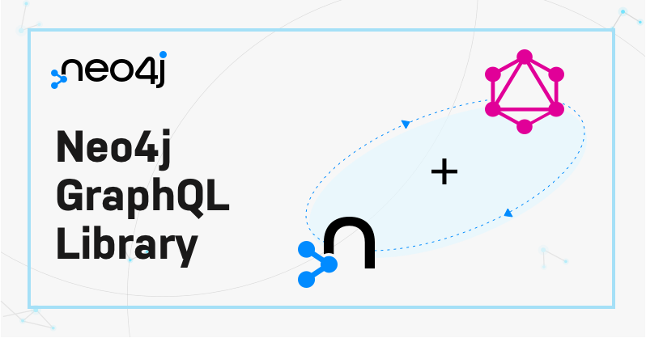

# Neo4j GraphQL Library

💡 Welcome to the Monorepo for [Neo4j](https://neo4j.com/) + [GraphQL](https://graphql.org/).

___

**GraphQL API for Aura**  
We’ve been working to make GraphQL natively available in [Aura](https://neo4j.com/cloud/platform/aura-graph-database/), Neo4j's Cloud based Graph Database service,  and we are now ready to let people try it in an Early Access Program that will run from April to the end of May.  There will be at least one more iteration with additional features before a full release later this year.

This will offer

* Use of GraphQL API with an Aura instance in GCP
* Use of Aura CLI to configure the GraphQL API
* Authentication to the GraphQL API using an API Key or a 3rd party Identity Provider that supports OpenID Connect 2.0 with a JWKS endpoint for JWT validation
* A Discord based community to post feedback and questions that you have

Using the GraphQL API during the EAP with AuraDB instances being charged as normal will be at no cost.

Would you be interested in taking part? Or want to know more? Then register here:-  [GraphQL API EAP](https://forms.gle/gr8n8sx8S8yXFZzj8) and you'll be contacted nearer the date.
___

  
  

## Contributing

The default branch for this repository is `dev`, which contains changes for the next
release. This is what you should base your work on if you want to make changes.

Want to contribute to `@neo4j/graphql`? See our [contributing guide](./CONTRIBUTING.md)
and [development guide](./docs/contributing/DEVELOPING.md) to get started!

## Links

* [Documentation](https://neo4j.com/docs/graphql-manual/current/)
* [Discord](https://discord.gg/neo4j)
* [Examples](./examples)
* [Hands-on Course](https://graphacademy.neo4j.com/courses/graphql-basics/?ref=graphql)
* [Neo4j Community](https://community.neo4j.com/c/drivers-stacks/graphql/33)

## Navigating

This is a TypeScript Monorepo managed with [Yarn Workspaces](https://classic.yarnpkg.com/en/docs/workspaces/).
To learn more on how to; setup, test and contribute to Neo4j GraphQL then please
visit the [Contributing Guide](./CONTRIBUTING.md).

* [`@neo4j/graphql`](./packages/graphql) - Familiar GraphQL generation, for usage
   with an API such as [Apollo Server](https://www.apollographql.com/docs/apollo-server/)
* [`@neo4j/graphql-ogm`](./packages/ogm) - Use GraphQL Type Definitions to drive
   interactions with the database
* [`@neo4j/introspector`](./packages/introspector) - Introspect schema from an existing Neo4j database
* [`@neo4j/graphql-toolbox`](https://www.github.com/neo4j/graphql-toolbox) - Experiment with your Neo4j GraphQL API on Neo4j Desktop.

## Media

Blogs, talks and other content surrounding Neo4j GraphQL. Sign up for
[NODES 2023](https://dev.neo4j.com/44xcEfm) to view even more Neo4j
GraphQL content.

* [Neo4j and GraphQL The Past, Present and Future](https://youtu.be/sZ-eBznM71M)
* [Securing Your Graph With Neo4j GraphQL](https://medium.com/neo4j/securing-your-graph-with-neo4j-graphql-91a2d7b08631)
* [Best Practices For Using Cypher With GraphQL](https://youtu.be/YceBpk01Gxs)
* [Migrating To The Official Neo4j GraphQL Library](https://youtu.be/4_rp1ikvFKc)
* [Announcing the Stable Release of the Official Neo4j GraphQL Library 1.0.0](https://medium.com/neo4j/announcing-the-stable-release-of-the-official-neo4j-graphql-library-1-0-0-6cdd30cd40b)
* [Announcing the Neo4j GraphQL Library Beta Release](https://medium.com/neo4j/announcing-the-neo4j-graphql-library-beta-99ae8541bbe7)
* [Working with Graphs and GraphQL](https://youtu.be/qXQDG2GAs5w)

## Learn with GraphAcademy

Learn the fundamentals of GraphQL and how to use the Neo4j GraphQL Toolbox and the Neo4j GraphQL Library to create Neo4j-backed GraphQL APIs with the [Introduction to Neo4j & GraphQL on GraphAcademy](https://graphacademy.neo4j.com/courses/graphql-basics/?ref=graphql).
