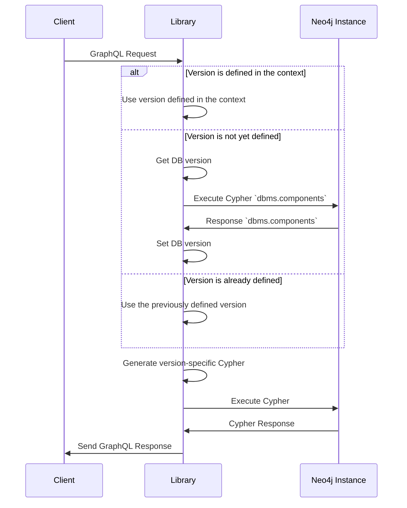

# Database info

## Problem

Providing compatibility with multiple Neo4j versions comes with some difficulty.
Different Neo4j versions require different Cypher queries to obtain the same result. Without knowing where the query will be executed during the query generation, it's not possible to change the query accordingly.

For instance, let's consider the following example:

```cypher
RETURN distance(point({x:10, y:5}), point({x:10, y:10}))
```

Which produces `5.0` using `Neo4j 4.x`, it will result in an error if used against a `Neo4j 5.x` instance.
The same query could be written as:

```cypher
RETURN point.distance(point({x:10, y:5}), point({x:10, y:10}))
```

Which can be executed against a `Neo4j 5.x` instance.

## Proposed Solution

From version `Neo4j 3.5` the procedure `dbms.components` can be used as:

```cypher
call dbms.components() yield name, versions, edition unwind versions as version return name, version, edition;
```

to obtain the following:

| name           | version | edition      |
| -------------- | ------- | ------------ |
| "Neo4j Kernel" | "4.4.5" | "enterprise" |

with this information available it's possible to write an optimal query.
To make this available to the resolvers, it is possible to add a new class `Neo4jDatabaseInfo` to the GraphQL `Context`.

An essential implementation of the `Neo4jDatabaseInfo`:

```typescript
interface Neo4jVersion {
    major: number;
    minor: number;
}

class Neo4jDatabaseInfo {
    public version: Neo4jVersion;
    public edition: string;

    constructor(version: Neo4jVersion, edition: string) {
        this.version = version;
        this.edition = edition;
    }
}
```

### Application Flow



### Usage Examples

As the `Context` holds the new `Neo4jDatabaseInfo` class is now possible to use it as follows:

```javascript
const { resolveTree, Neo4jDatabaseInfo } = context;
if (Neo4jDatabaseInfo.version.major > 4) {
    return "RETURN point.distance(point({x:10, y:5}), point({x:10, y:10}))";
} else {
    return "RETURN distance(point({x:10, y:5}), point({x:10, y:10}))";
}
```

### Technical considerations

#### Lazy initialization

As at the startup of the library, a database connection could be not present, the `Neo4jDatabaseInfo` need to be initialized when needed.

#### Roundtrips to the Database

It will be better to avoid unnecessary roundtrips for every request that will create a network and performance overhead.

#### Database updates

The implementation needs to handle the case where the database version is updated while the Neo4j Graphql library is running.

#### Context defined driver

The implementation needs to handle the case where the driver configuration is passed in a GraphQL Context.

## Risks

### Security consideration

None.

## Out of Scope

-   Multiple drivers configuration
-   Mulitple Neo4j instances using not the same version
