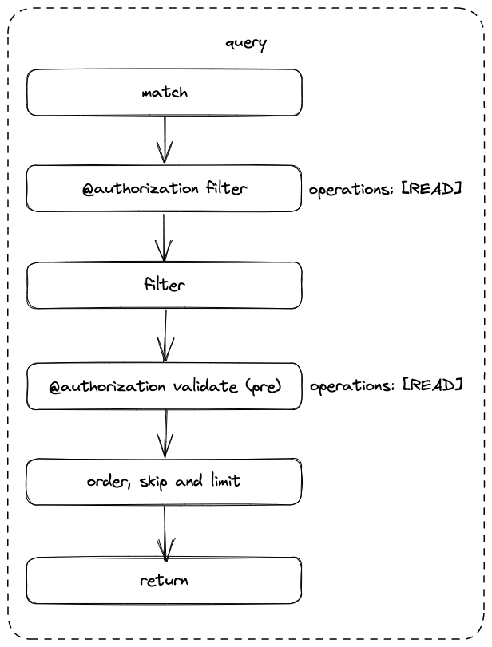
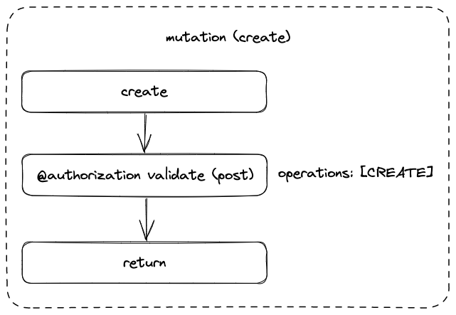
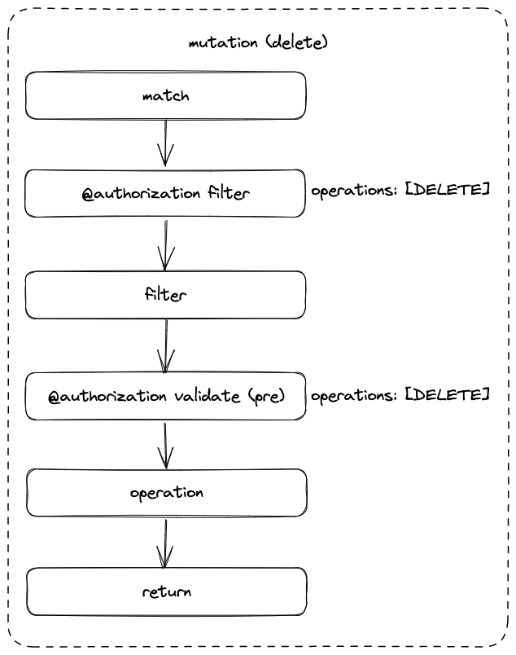
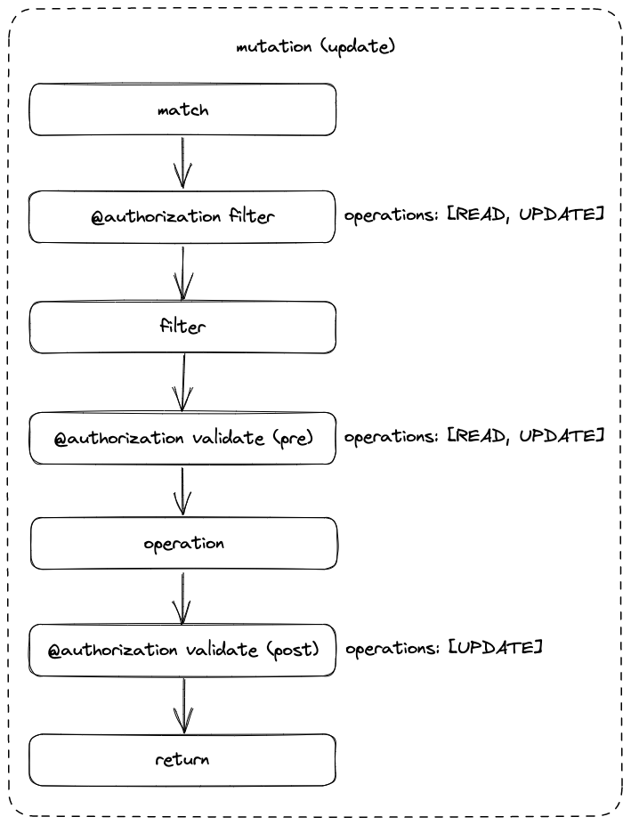
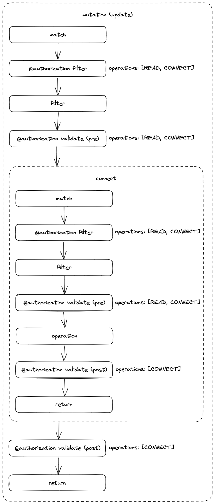
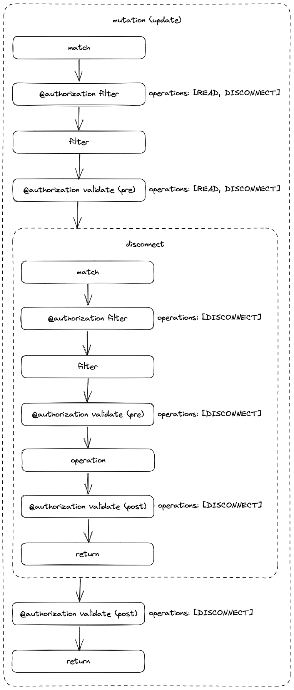

# Authorization

## Outstanding questions

* Are we only going to allow for fixed JWT fields (for example, `roles`), or are we going to allow arbitrary fields? How do we do typing?

## Problem

Authorization is currently bundled into the `@auth` directive, alongside authentication, as well as additional functionality such as `bind`. Combining these behaviours is often unclear.

## Solution

### Directive

The proposed directive is a complex dynamic type which will be generated purely for the purposes of schema validation, but will not be included in the output schema.

`<Type>` is the typename of each of a user's types. For instance, given the following type:

```gql
type User {
  id: ID!
}
```

`<Type>` below will be `User`.

```gql
enum AuthorizationOperation {
  CREATE
  READ
  UPDATE
  DELETE
  CONNECT
  DISCONNECT
}

input JWTPayload {
  roles
}

input <Type>AuthorizationWhere {
  ... <Type>Where

}

input <Type>AuthorizationRule {
  operations: [AuthorizationOperation!]! = [CREATE, READ, UPDATE, DELETE, CONNECT, DISCONNECT]
  requireAuthentication: Boolean! = true
  where: <Type>AuthorizationWhere!
}

input <Type>AuthorizationValidate {
  pre: [<Type>AuthorizationRule!]
  post: [<Type>AuthorizationRule!]
}

directive @authorization(
  filter: [<Type>AuthorizationRule!]
  validate: <Type>AuthorizationValidate
) on OBJECT | FIELD_DEFINITION | SCHEMA | INTERFACE
```

#### User input validation

Validation of user input of `@authorization` directives will be performed on a per-type basis.

For example, given the `User` type above, this will be extracted out with its `@authorization` directive, the above type generated, and then validation performed against that type only.

### Roles

Roles will be available for all rule types. They will be nested within the `where` field to allow for complex logic with node properties.

### Rules

Each category of rule can be seen as being applied with an `AND`. Within each rule set, rules are combined with an `OR`, in that we will fall through the rules until we get a hit (or not).

#### Filter rules

Filter rules will be applied immediately after node `MATCH`, and then combined with user input (filters specified in GraphQL input) using an `AND`.

#### Validate rules

##### Pre

These rules are applied prior to return for a Query, or before the execution of a write operation for a Mutation.

##### Post

These rules are applied following a write operation for Mutations, before the return of data.

### Query

Rule support:

* Filter
* Validate (pre)



### Mutation

#### Create

Rule support:

* Validate (post)



#### Delete

Rule support:

* Filter
* Validate (pre)



#### Update

Rule support:

* Filter
* Validate (pre)
* Validate (post)



##### Connect

Rule support:

* Filter
* Validate (pre)
* Validate (post)



##### Disconnect

Rule support:

* Filter
* Validate (pre)
* Validate (post)


