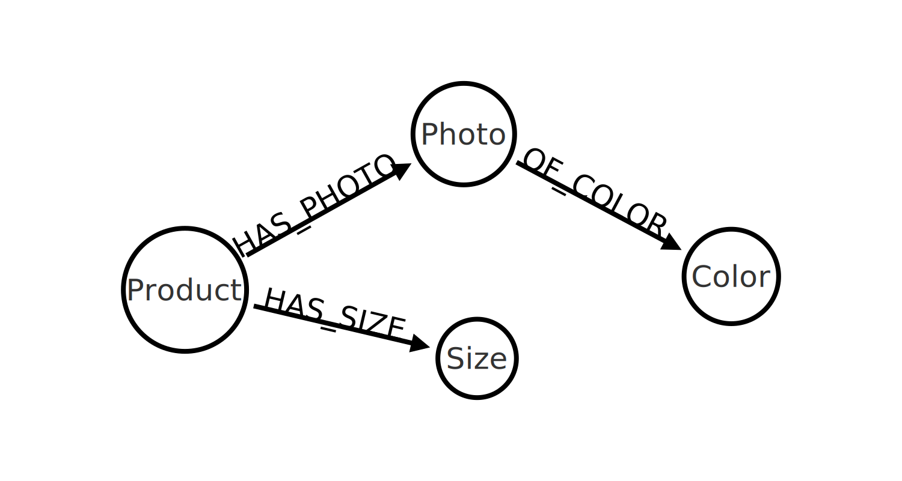
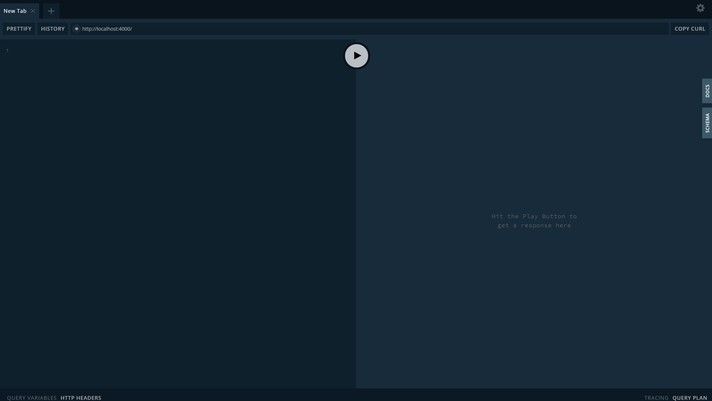
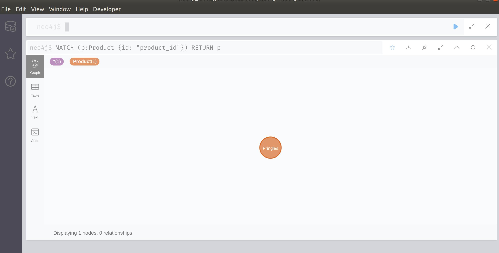
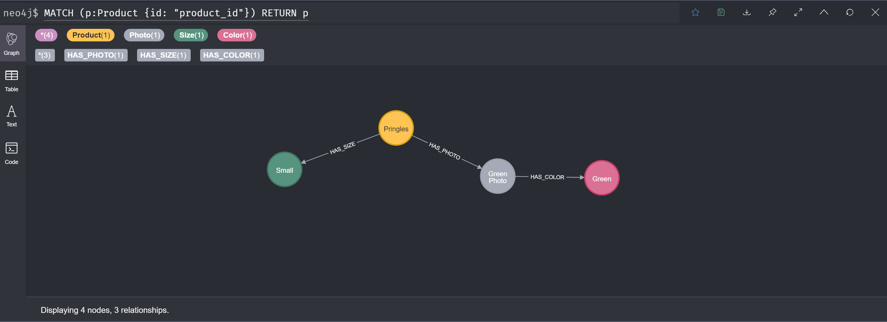

# Tutorial

> This chapter is a tutorial that takes the reader through steps necessary to get started with the neo4j/graphql.


## Shop

In This Section we will guide you through how you could setup the GraphQL api to work with the following data model;



> Before starting make sure you have setup a Neo4j Instance. [Neo4j Sandbox](https://neo4j.com/sandbox/) is great to get started quickly.


### Defining Type Definitions

First you need to take the model and represent it using GraphQL schema language;

```graphql
type Product {
    id: ID
    name: String
    photos: [Photo] @relationship(type: "HAS_PHOTO", direction: "OUT")
    sizes: [Size] @relationship(type: "HAS_SIZE", direction: "OUT")
}

type Photo {
    id: ID
    description: String
    color: Color @relationship(type: "HAS_COLOR", direction: "OUT")
}

type Size {
    id: ID
    name: String
}

type Color {
    id: ID
    name: String
}
```

In the Javascript ecosystem you have many ways to define thease `typeDefs` such as;

**GraphQL Tag**

> Great support for in-code syntax highlighting

```js
const gql = require("graphql-tag");

const typeDefs = gql`
    type Product {
        id: ID
        name: String
    }        
`;
```

**.GraphQL Files**
```js
const fs = require("fs");

const typeDefs = fs.readFile("./type-defs.gql", "utf-8");
```

**Strings**
```js
const gql = require("graphql-tag");

const typeDefs = `
    type Product {
        id: ID
        name: String
    }        
`;
```

### Generating Your Schema

Once you have picked the best for you its time to provide tease `typeDefs` into the library's exposed function `makeAugmentedSchema`;

```js
const { makeAugmentedSchema } = require("@neo4j/graphql");

const neoSchema = makeAugmentedSchema({ typeDefs })
```

`makeAugmentedSchema` will parse the provided `typeDefs` and spit out a instance of `NeoSchema`. On the instance the most used property will be `.schema` an instance of `GraphQLSchema`. Using this property we can directly pass it into third party tools such as `ApolloServer`;

### Starting Your Server
This tutorial will use [Apollo Server](https://www.apollographql.com/docs/apollo-server/getting-started/). But you could use any GraphQL compliant, Javascript, offering.

⚠ Do not forget to construct and inject the `neo4j-driver`

```js
const neo4j = require("neo4j-driver");
const { makeAugmentedSchema } = require("@neo4j/graphql");
const { ApolloServer } = require("apollo-server");

const typeDefs = `
    type Product {
        id: ID
        name: String
        photos: [Photo] @relationship(type: "HAS_PHOTO", direction: "OUT")
        sizes: [Size] @relationship(type: "HAS_SIZE", direction: "OUT")
    }

    type Photo {
        id: ID
        description: String
        color: Color @relationship(type: "HAS_COLOR", direction: "OUT")
    }

    type Size {
        id: ID
        name: String
    }

    type Color {
        id: ID
        name: String
    }       
`;

const neoSchema = makeAugmentedSchema({ typeDefs });

const driver = neo4j.driver("bolt://localhost:7687", neo4j.auth.basic("admin", "password"));

const server = new ApolloServer({
    schema: neoSchema.schema,
    context: { driver },
});

async function main(){
    await server.listen(4000);
    console.log("http://localhost:4000");
}

main()
```

### Navigating To Playground
[Apollo Server](https://www.apollographql.com/docs/apollo-server/getting-started/) comes with a neat playground, to test GraphQL queries. Once you run your server using the example provided in [Starting Your Server](#Starting-your-Server) navigate, in your browser, to http://localhost:4000. You should be greeted with something like;



### Inspecting the Schema
Using the playground you can inspect the generated schema by clicking the `schema` tab. This will tell you what Queries and Mutations you can call. Think of Queries and Mutations to be functions that fetch and modify data in your Neo4j database.

Queries;

```graphql
type Query {
  Products(where: ProductWhere, options: ProductOptions): [Product]!
  Photos(where: PhotoWhere, options: PhotoOptions): [Photo]!
  Sizes(where: SizeWhere, options: SizeOptions): [Size]!
  Colors(where: ColorWhere, options: ColorOptions): [Color]!
}
```


Mutations;

```graphql
type Mutation {
  createProducts(input: [ProductCreateInput]!): [Product]!
  deleteProducts(where: ProductWhere): DeleteInfo!
  updateProducts(
    where: ProductWhere
    update: ProductUpdateInput
    connect: ProductConnectInput
    disconnect: ProductDisconnectInput
    create: ProductRelationInput
  ): [Product]!
  createPhotos(input: [PhotoCreateInput]!): [Photo]!
  deletePhotos(where: PhotoWhere): DeleteInfo!
  updatePhotos(
    where: PhotoWhere
    update: PhotoUpdateInput
    connect: PhotoConnectInput
    disconnect: PhotoDisconnectInput
    create: PhotoRelationInput
  ): [Photo]!
  createSizes(input: [SizeCreateInput]!): [Size]!
  deleteSizes(where: SizeWhere): DeleteInfo!
  updateSizes(where: SizeWhere, update: SizeUpdateInput): [Size]!
  createColors(input: [ColorCreateInput]!): [Color]!
  deleteColors(where: ColorWhere): DeleteInfo!
  updateColors(where: ColorWhere, update: ColorUpdateInput): [Color]!
}
```

### Creating Your First Node
Lets being with creating our first Product. In your playground instance, on th left hand side, create your product;

```graphql
mutation {
    createProducts(input:[{
        id: "product_id",
        name: "Pringles"
    }]){
        id
        name
    }
}
```

If your using [Neo4j Browser](https://neo4j.com/developer/neo4j-browser/) or [Neo4j Desktop](https://neo4j.com/developer/neo4j-desktop/) you can query for this data & you should have the following in your database;




### Connecting Nodes
Now we have a product we need to build some relations. Here we will use the `updateProducts` Mutation to create and connect the product to all the `relationships` stated in our `typeDefs`. We will be creating a Green Photo, Small Size and Green Color all related together;

```graphql
mutation {
  updateProducts(
    where: { id: "product_id" }
    update: {
      sizes: { create: [{ id: "small_size_id", name: "Small" }] }
      photos: {
        create: [
          {
            id: "green_photo_id"
            description: "Green Photo"
            color: { create: { id: "green_color_id", name: "Green" } }
          }
        ]
      }
    }
  ) {
    id
  }
}
```

This above query is using a feature called 'Nested Mutations' available on both create and update mutations. After executing your data should look something like;




Its worth point out that you could have bypassed the extra update mutation and create the Product, Size, Photo and Color in the initial create call; 

```graphql
mutation {
  createProducts(
    input: [
      {
        id: "product_id"
        name: "Pringles"
        sizes: { create: [{ id: "small_size_id", name: "Small" }] }
        photos: {
          create: [
            {
              id: "green_photo_id"
              description: "Green Photo"
              color: { create: { id: "green_color_id", name: "Green" } }
            }
          ]
        }
      }
    ]
  ) {
    id
  }
}

```

#### Connecting To Existing Nodes
The above Mutations are demonstrating creating and connecting to node...however if you only want to connect to a node, without creating a new one, use the sub property `connect`. Here we connect the product to a pre-existing Photo. 

```graphql
mutation {
  updateProducts(
    where: { id: "product_id" }
    update: { photos: { connect: { where: { id: "exiting_photo" } } } }
  ) {
    id
  }
}
```

⚠ If `exiting_photo` is not found the mutation will bypass the operation and not attempt to `MERGE`.